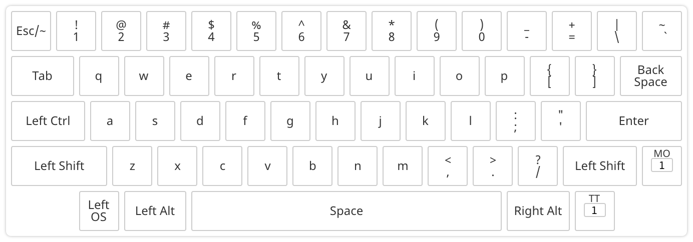
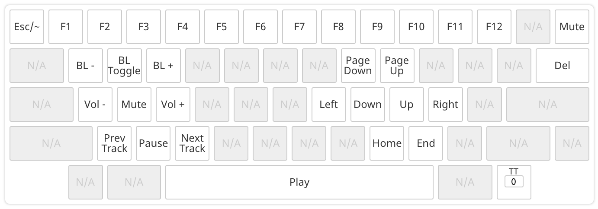

# Tokyo60 Keyboard

[Keyboard](https://www.massdrop.com/buy/massdrop-x-tokyo-keyboard-tokyo60-keyboard-kit)

## Default MacOs

Includes my default key mapping for MacOS.

Created using [QMK Configurator](https://config.qmk.fm/#/tokyo60/LAYOUT_60_hhkb).

Layer 0:

Layer 1:

